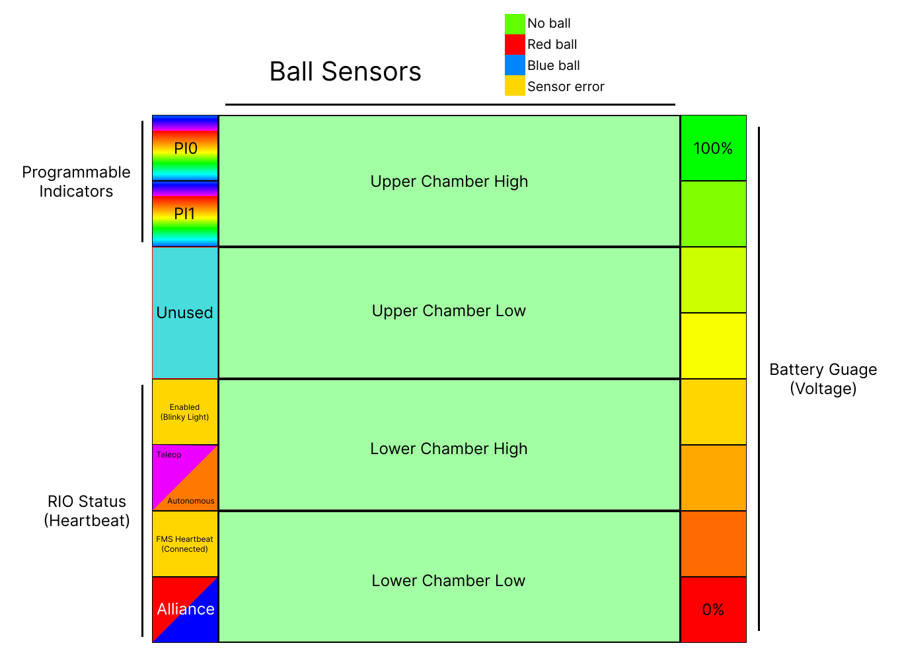

# ChuteManager v3

### A status viewer for LED panels.

The `ChuteManager_3` sketch is capable of displaying a status board and a splash image, and it can switch between the two on command. The status board shows current alliance, FMS heartbeat, game stage (autonomous or teleop), enabled/disabled status, data from up to 4 color sensors (pointed at the ball chambers in the 2022 season), and a voltage gauge.

## Basic configuration

In the `ChuteManager_3.ino` file, change the values of these fields:
- `PIN_STRIP1` - the pin number that the LED panel is connected to
- `MATRIX_WIDTH` - the width of the LED panel, in pixels
- `MATRIX_HEIGHT` - the height of the LED panel, in pixels
- `MAX_STRIP_BRIGHTNESS` - the global brightness of the LED panel, from 0-255 (warning: the higher you go, the less noticable difference there is between brightness levels, but power consumption is linear)
- `NUM_REV_LIGHT_SENSORS` - the number of color sensors to display (max of 4)

## Changing the splash image

See the `matrix` documentation -- this sketch reads the same splash image data to display the splash image. Note that the image will not display on boot. The display mode must be changed to view the image.

## Changing the display mode with an external device

See [this Java subsystem](https://github.com/Team2530/RobotCode2022/blob/38934b8de467ff60d1c1c704b48769e4b2c3c15e/src/main/java/frc/robot/subsystems/FeedbackPanel.java) for an example. "Boot" refers to the splash image. "Status" displays the status board. "Climb" is unimplemented in ChuteManager and therefore undefined behavior.