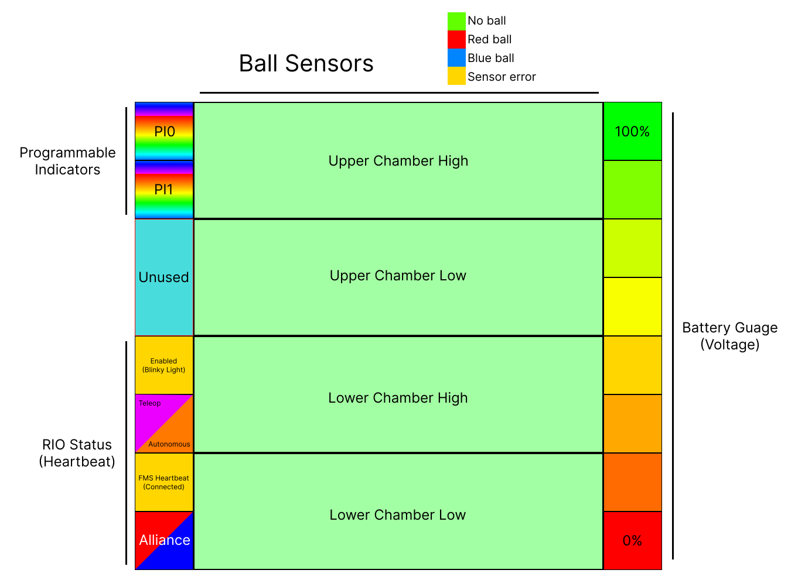

# Compliance with FRC CAN bus specification

The `ChuteManager_3` and `SDCANLogger` programs are currently used for our robot in competition. 

SDCANLogger does not control everything, and does not respond to CAN frames, it is simply a passive listener.

ChuteManager_3 Controls lights, sensors, and responds to halt broadcasts and absent heartbeat. 

Our device transmits and receives on a fixed address

- Manufacturer 8 (team use)

- Device type 10 (misc)

- Device number (default) 3
  
  - Pins 10 and 9 on the device can be pulled down to turn off bits in the device number, by default both pins are pulled high with an internal resistor.

- Using the following API classes (note: in WPILib robot code, API *class* must be shifted left 4 to convert it into a API *ID* used by the WPILib CAN API because our device doesn't use API indices)
  
  - 32 is used when sending messages to the RIO
    
    - One byte per sensor
  
  - 25 is used to control indicators on the LED panel
    
    - Two 24-bit RGB triplets, one for each indicator
  
  - 28 is used to display indexed images on the LED panel
    
    - Single byte for index

The device also receives messages from the PDP regarding battery level, and displays a battery guage.

A library for our Java robot code has been made, you can find it in our team's robot code for this year: [InCANDevice.java](https://github.com/Team2530/RobotCode2022/blob/main/src/main/java/frc/robot/InCANDevice.java) (Base class for device interfacing), [Chambers.java](https://github.com/Team2530/RobotCode2022/blob/main/src/main/java/frc/robot/subsystems/Chambers.java) (Receives ball sensor data from the device), [Indicators.java](https://github.com/Team2530/RobotCode2022/blob/main/src/main/java/frc/robot/subsystems/Indicators.java) (Controls programmable indicators), and [FeedbackPanel.java](https://github.com/Team2530/RobotCode2022/blob/main/src/main/java/frc/robot/subsystems/FeedbackPanel.java) (For displaying images).

